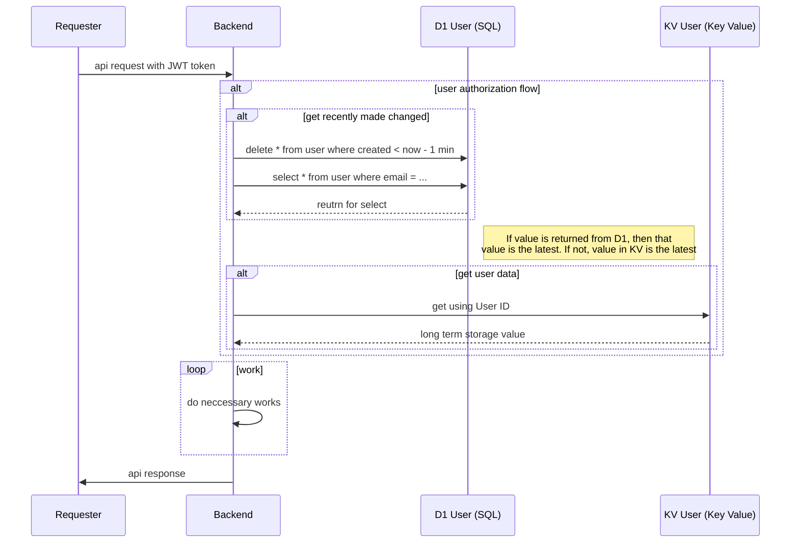
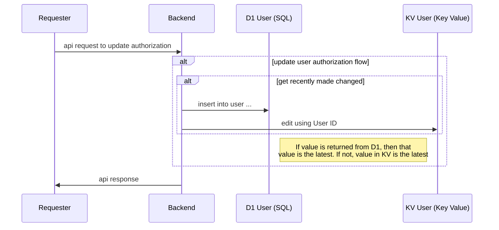

# sas-auth-manager

As a person who have been worked on SAS infrastructures and services almost all of my professional life, one of the common challenge for providing SAS service is authentication, authorizations, and user managements using JWT token for a user access.

I have seen may different solutions but they all comonnly have below issues.

1. JWT token is immutable
   in my experiences biggest problem with JWT token is that it is trying to solve both authenitcation and authorization at the same time and results in making a compromises.  i.e. when a user's scope changes triggered by authorization change, a new token must be issued as JWT token is immutable.  This is one of the troubling point of the user experiences.
2. [there is no good way to invalidate JWT token](https://stackoverflow.com/questions/21978658/invalidating-json-web-tokens)
   once a JWT token is created created it is valid and there is no good way to invalidate it.  i.e. if a user logged in and then user's access is removed then the token is techinicaly valid until it's experiation time without additional logic
3. mulitple JWT tokens per user
   because of aforemntioned issues, often there are multiple JWT tokens are used by a single user.  i.e. separate JWT token per a resource per user.  This further complicates user and access managements.
4. cost
   popular solutions such as okta and auth0 often cost more than $3000 per month for enterprise with various limits and restricitons

This project is my attempt at providing a generalized solution for SAS user managements, specifically focusing to address above issues.

## Key design philosophies

These are the key design philosophies to be acheived by  designing the solution.

### Authenticaiton and authorization is a separate issue

Authentication, who you are, and authorization, what you can do, is a separate issue.  There are many solutions tries to be a silver bullet to solve both issues all the while being secure, i.e. JWT token.

Adhering to divide and conquor strategy, these problems should be divided and conquered separately as it creates confusion, complications and compromises.

### Idempotent changes

User management must be predictable and reliable.  All applied changes must be consistent and idempotent.

### Flexible

System should be able to easily handle user's authentication and authroization changes quickly without any delays or additional issues.

---

## Solution

### Use JWT token as as authentication only using the Supertoken

JWT token is great of granting an access for a none machine use cases.  We would simply under utilize the `scope` of JWT token as authoriation is handled separatley and continue to use signed and verified payload of the JWT token payload.  Most importantly, user identifier which are user email.

And [Supertoken is an opensource](https://supertokens.com/) is the perfect fit for this use case as it is free and feature complete.

### Authorization is handle separately using signed user identifier from JWT token

Once JWT token is created, a token's payload can be trusted because it is signed and imutable.  Using this fact, we can use user identifier to grant authorization separatlely.  For example, when backend receives JWT token from the requester, and use the extracted identifier to further fetch for the access authorization for the token. So if `john@smith.com` is the identifier for the user, then we can  associate `admin `or `read-only `accesses to the email `john@smith.com` per request separately.

### Using cloudflare

Cloudflare by far the easiest to use and cheapest cloud solution out there, especially [considering no ingress and egress cost](https://community.cloudflare.com/t/cloudflare-workers-as-data-transit-proxy-how-is-egress-ingress-data-charged/673586).  Furthermore, it has two crucial database solutions that can be used to provide fast, strongly consistent and cost efficient authentication and authorization solution.

#### Cloudflare KV

[Cloudflare KV](https://developers.cloudflare.com/kv/) is an eventually consistent, globaly accessible, key value storage that is very cheap.  However it's [write-after-write consistency](https://developers.cloudflare.com/kv/concepts/how-kv-works/#consistency) model can take up to 60 seconds for a write to be accessible.

#### Cloudflare D1

[Cloudflare D1](https://developers.cloudflare.com/d1/) is a region based [SQL solution with strong consistency](https://blog.cloudflare.com/d1-read-replication-beta/#consistency-with-and-without-sessions-api).

## Summary

Authentication is handled by supertoken.  Get and updating user authorization flow can be found below.

### Get user authorization flow

### Update user authorization flow

## POC

[https://sas-org-user-management.pages.dev/]()

POC Implmentation for the aforementioned auth solution can be found above.  Using cloudfare, supertoken, pulumi, vue and typescripts.  

Once login, one can create an organization, an object that represents collection of users, and add user to that organization with various authorizations such as `admin`, `write` and `read` roles based on cloudflare's free plan.
